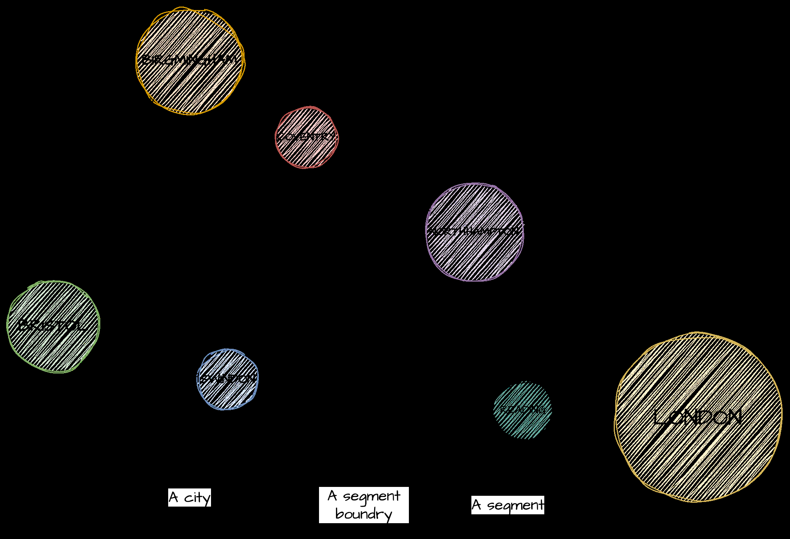

**“Ticket to ride“ application**

**Functionality:**
The application provides an API with two endpoints:
1. Allow to calculate price and find the most optimal travel between two towns.
2. Check if traveller has enough money and save the ticket in the storage if he/she does.
Authentication & authorization: Traveller registration endpoint.

**Technologies:**
Java 21, Spring Boot, Spring Data, Spring Security, JUnit 5, Mockito, PostgreSQL, Maven

When starting the application, the Configuration loads a file with the primary list of roads (routes.txt),
according to Roads Schema into the database.

**API endpoints:**
1. Find a ticket
Public endpoint, that allows to calculate price and find the most optimal travel between two towns (points).
  URL: /api/find_ticket
  Method: Get
  Query parameters: from, to
  Response example:
    {
     "id": null,
     "routesChain": "LONDON - READING - SWINDON - BRISTOL",
     "price": 25.00,
     "segments": 7
    }
2. Traveller registration
    URL: /register/traveller
    Method: Post
    Request example:
   {
    "username": "traveller",
    "password": "12345"
   }
   Response example:
   {
    "id": 1,
    "username": "traveller",
    "password": "$2a$10$IuYPFQrnPXyQ792lNwSliupQiCJel4J4KyhiyUYx8evlEVAtQ2h7S",
    "role": "TRAVELLER"
   } 
3. Save a ticket
Private endpoint. Check if traveller has enough money and save the ticket in the storage if he/she does.
    Query parameters: amount
    Request example:
   {
    "id": null,
    "routesChain": "LONDON - READING - SWINDON - BRISTOL",
    "segments": 7,
    "price": 25
   }  
    Response example:
   {
    "result": "success",
    "change": "1.00",
    "currency": "GBP"
   }
